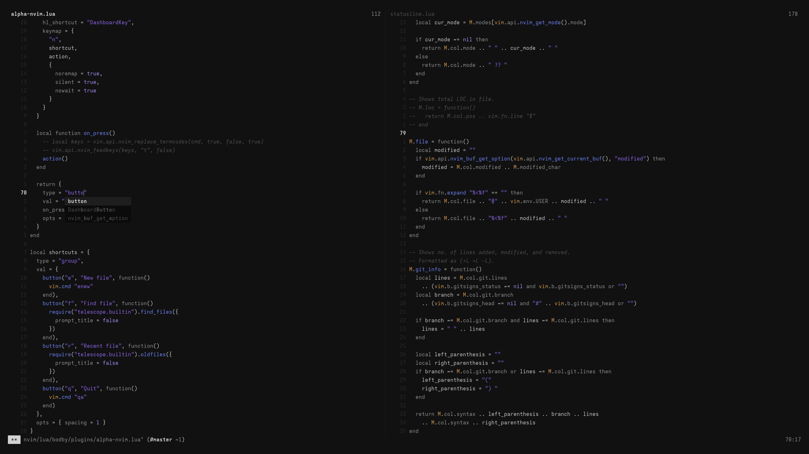

# About

My Neovim configuration, available as a Nix flake. Based off of [kickstart-nix.nvim](https://github.com/nix-community/kickstart-nix.nvim).

To test it out without installing, run:

```command
nix run 'github:bodby/nvim-cfg'
```

## Screenshots

Font used is a custom build of Iosevka that I don't have on GitHub (yet).



