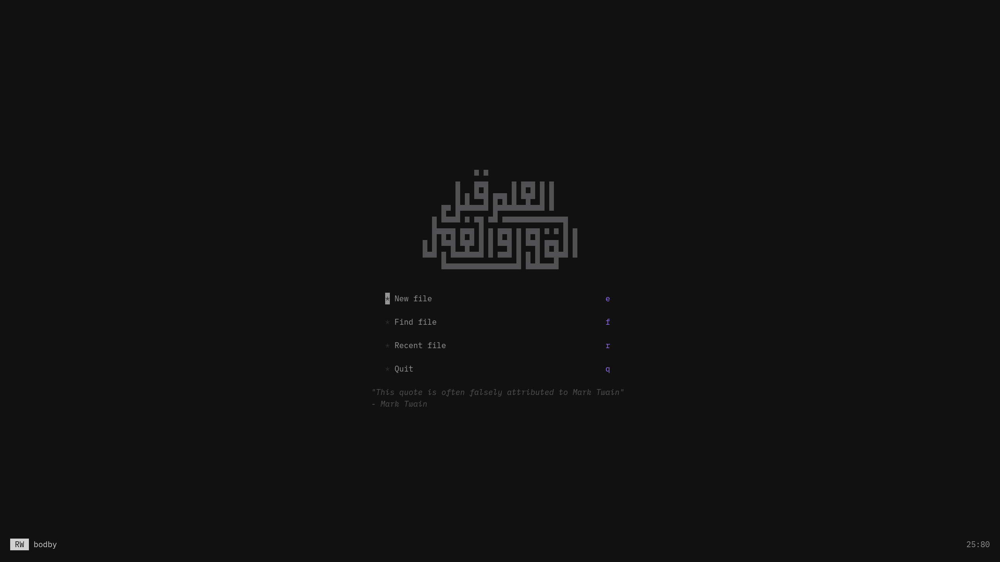
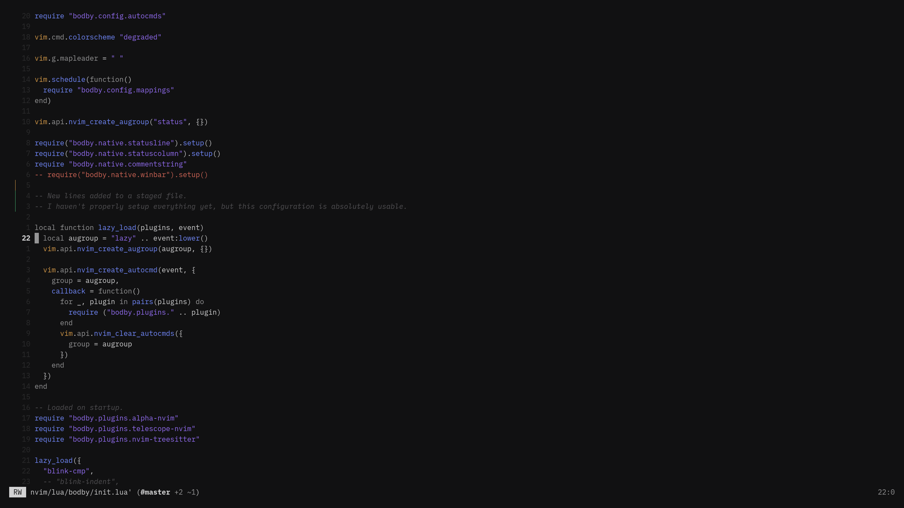
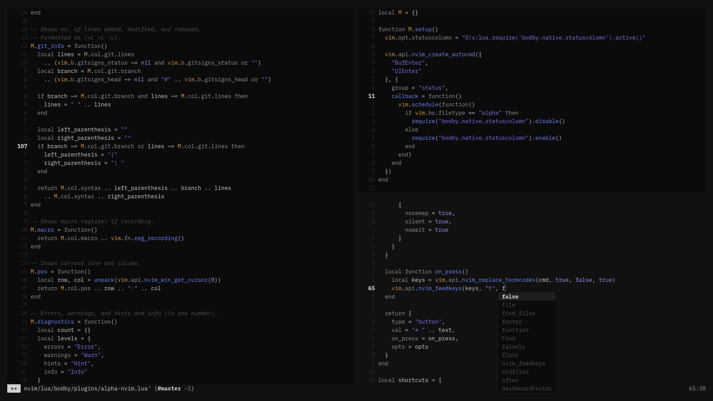

# About

My Neovim configuration, available as a Nix flake. Based off of [kickstart-nix.nvim](https://github.com/nix-community/kickstart-nix.nvim).

To test it out without installing, run:

```command
nix run 'github:bodby/nvim-cfg'
```

## Screenshots

<<<<<<< HEAD
Font used is IBM Plex Mono.


=======

>>>>>>> 51fe276 (README: Moved images to .github/)



<<<<<<< HEAD

=======

>>>>>>> 51fe276 (README: Moved images to .github/)
